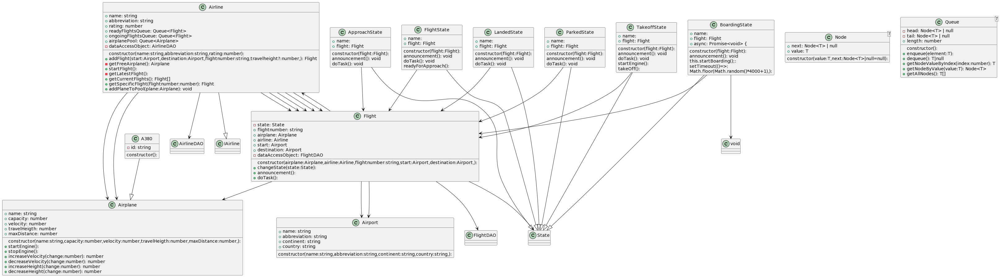

# Scope

A simple typescript application to play around with different states of planes, airlines, ...

The first draft of a class diagramm is included (see below)

# Future

## TODO

A database will be introduced in order to save airlines and their flights

## Classdiagram

- autogenerated for PlantUML
